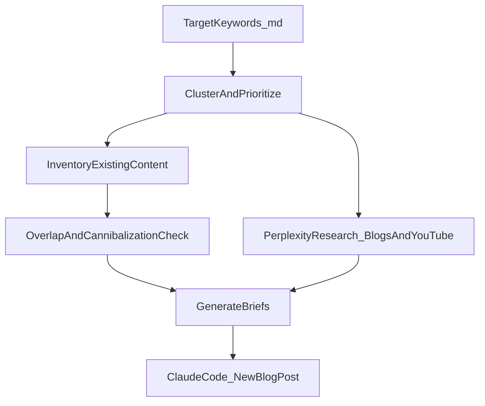

# REmail Content Creation Pipeline (Keywords → Research → Briefs → Publish)

This doc defines a **repeatable content generation workflow** for REmail:

- Start from our keyword strategy in `docs/TARGET-KEYWORDS.md`
- Use **Perplexity** to research topical blog content + relevant YouTube videos
- Produce **content briefs** (headline, summary, target keywords, outline, citations)
- Include a **keyword overlap / density** check against existing site content to avoid cannibalization
- Feed the brief into Claude Code’s `/new-blog-post` command to generate and publish a post to `content/blog/[slug].mdx`

---

## Inputs (source of truth)

- **Keyword strategy**: `docs/TARGET-KEYWORDS.md`
- **Existing blog content** (avoid duplicate intent/topics): `content/blog/*.mdx`
- **Existing marketing pages** (avoid cannibalizing money pages): `src/app/(marketing)/**/page.tsx`
- **Publishing command**: `.claude/commands/new-blog-post.md` (creates `content/blog/[slug].mdx`)

---

## Outputs (what you generate each cycle)

A **Content Brief Pack** (markdown; optional CSV/JSON) containing N briefs (recommendation: **20 per quarter**).

Each brief includes:

- **Headline (SEO-safe)** + **Headline (attention-first)**
- **Summary** (reader outcome + why this topic matters)
- **Target keywords**
  - Primary keyword
  - 5–10 secondary/supporting keywords
  - Suggested internal-link anchors (2–5)
- **Outline** (6–10 H2/H3 headings)
- **Internal links** (minimum 3; include a money link like `/pricing` or `/contact`)
- **Perplexity research citations**
  - 3–8 links: best-in-class blog posts + credible sources + 2–3 YouTube videos
  - 5–10 “extractable facts” to support the final post
- **Overlap report** vs existing content (Low/Medium/High + most-similar pages/posts)
- **Keyword distribution / density guidance** (placement plan; no stuffing)

---

## Workflow

---

## Step 1 — Cluster & prioritize keywords

From `docs/TARGET-KEYWORDS.md`:

- **Extract** Tier 1–3 keywords (high-volume + quick wins).
- **Cluster** into hubs, e.g.:
  - Skip tracing
  - Wholesaling / flippers (audience)
  - Property lists (pre-foreclosure, tax delinquent, probate, vacant, tired landlord)
  - Direct mail templates (postcards, yellow letters)
  - Head terms (direct mail marketing, direct mail services, mailing list)
- **Prioritize** with a simple scoring heuristic:
  - Higher volume wins
  - LOW competition gets a bonus (quick wins)
  - Higher CPC gets a bonus (commercial intent)
  - Stronger product-fit gets a bonus (campaign automation, lists, tracking, templates)

Suggested quarterly mix (20 briefs):

- 6–8 **quick wins** (LOW competition)
- 6–8 **hub content** (pillar + supporting articles)
- 4–6 **commercial-intent** posts that naturally support a CTA to REmail

---

## Step 2 — Inventory existing content (coverage map)

Build a quick “coverage map” so you can avoid cannibalization:

- For each existing blog post and marketing page, capture:
  - Title/H1
  - Key H2/H3 headings
  - The apparent primary keyword / intent

Current blog themes already covered (as of Jan 2026):

- Wholesaler direct mail strategy
- Direct mail vs cold calling
- Absentee owner lists

---

## Step 3 — Overlap / cannibalization check (per proposed brief)

For each proposed topic, label **Overlap Risk**:

- **Low**
  - No close match in existing titles/H1s/headings
  - Safe to publish as a standalone post
- **Medium**
  - Related to an existing hub/topic, but not the same intent
  - Must use a distinct angle + link to the existing related post/page
- **High**
  - Same keyword + same intent as an existing post/page
  - Action: consolidate into the existing content, or change the intent/audience/angle

Practical “fast checks”:

- If the **exact primary keyword** already appears in an existing **title/H1**, risk is usually **High**.
- If the keyword appears in headings/body but the intent differs, risk is often **Medium**.

---

## Step 4 — Perplexity research (blogs + YouTube)

Goal: collect **angles + citations + facts** so the eventual Claude-generated post is grounded, current, and differentiated.

For each target keyword/topic, capture:

- 2–3 dominant SERP angles (“what ranks and why”)
- 3–5 unique insights not covered on REmail yet
- 3–5 credible sources for statistics/benchmarks
- 2–3 YouTube videos (examples, objections, tactical walkthroughs)

### Suggested Perplexity query patterns

Blogs / SERP-style:

- `"skip tracing" real estate investors 2025 2026 guide benchmarks cost`
- `"tax delinquent list" real estate investors direct mail how to use`
- `"pre-foreclosure list" direct mail timeline compliance checklist`
- `"direct mail automation software" real estate investors comparison`

YouTube discovery:

- `site:youtube.com "skip tracing" real estate investors 2025`
- `site:youtube.com "tax delinquent list" wholesaling`
- `site:youtube.com "driving for dollars" vs direct mail`

---

## Step 5 — Keyword distribution / density guidance (per brief)

Avoid “keyword stuffing.” Prefer **placement + semantic coverage**.

### Primary keyword placement (recommended)

- Exact match in **H1**
- Included in **meta title**
- Included in the **first ~100 words**
- 1–2 H2s contain a **partial match**
- Natural usage throughout body

### Density guidelines (not hard rules)

- **Primary keyword**: ~0.6%–1.2%
- **Secondary keywords**: ~0.2%–0.6% each

If overlap risk is **Medium/High**, reduce repetitive usage of overlapping phrases and differentiate by:

- **Audience**: wholesalers vs flippers vs buy-and-hold
- **Intent**: how-to vs checklist vs benchmarking vs tool comparison
- **Scope**: pillar hub vs one narrow workflow

---

## Step 6 — Publish via Claude Code (`/new-blog-post`)

For each approved brief:

1. Run `.claude/commands/new-blog-post.md` with the topic/headline.
2. Include in the prompt:
   - Primary + secondary keywords
   - Perplexity citations + extractable facts
   - Overlap guidance (what existing post/page to link to, what not to duplicate)
3. Require:
   - Minimum word count (the command suggests 1,500+)
   - FAQ section
   - Internal links (3+)
   - Clear CTA to `/contact` or `/pricing`

---

## Content brief template (copy/paste)

- **ID / slug idea**:
- **Primary keyword**:
- **Secondary keywords (5–10)**:
- **Headline (SEO-safe)**:
- **Headline (attention-first)**:
- **One-paragraph summary**:
- **Search intent + audience**:
- **Differentiation vs existing content**:
- **Suggested outline (H2/H3)**:
- **Internal link targets (3+)**:
- **Perplexity citations (blogs + YouTube)**:
- **Extractable facts (5–10 bullets)**:
- **Overlap report**:
  - Risk (Low/Medium/High):
  - Most similar existing pages/posts:
  - How we avoid cannibalization:
- **Keyword distribution plan**:

---

## Recommended first-wave topics (low cannibalization vs current blog)

These align with `docs/TARGET-KEYWORDS.md` while avoiding duplication of the current 3 posts:

- Skip tracing pillar + supporting posts (e.g., “what is skip tracing real estate”)
- Tax delinquent list guide
- Pre-foreclosure list guide
- Probate leads guide
- Vacant property list guide
- Driving for dollars vs direct mail
- Direct mail automation / direct mail automation software
- Real estate postcards guide (creative + sequencing + tracking)
- Yellow letter guide (what it is, when to use, templates)
- Real estate mailing lists hub (links out to list-type guides and absentee owners)

